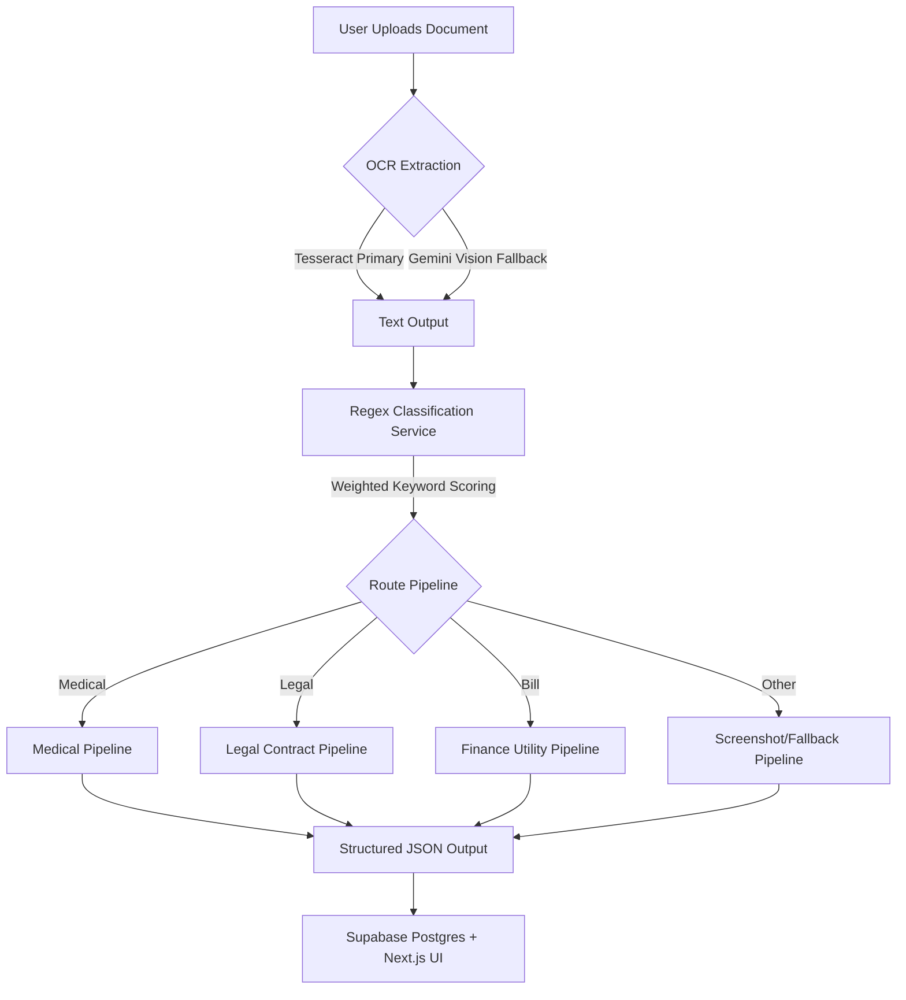

# CLARIFY AI — PRODUCT TECHNICAL REPORT

> **Document Type:** System Architecture & Technical Specifications  
> **Project Name:** Clarify AI ("Upload Anything. Understand Everything.")  
> **Author:** Antigravity AI Co-Pilot  
> **Version:** 1.0.0 (Production Scaffolding)  
> **Date:** July 10, 2026  

---

## PAGE 1 — EXECUTIVE SUMMARY & SYSTEM VISION

### 1.1 The Problem Statement
Every day, individuals receive complex, jargon-heavy documents that directly affect their health, finances, and legal standing. This includes:
*   **Medical Prescriptions:** Unclear dosage frequencies, complex generic compound names, and unlisted drug-to-drug interactions.
*   **Legal Agreements:** Non-disclosure agreements (NDAs), employment contracts, and rental leases containing hidden liability loops, exit constraints, or unfavorable clauses.
*   **Financial Utility Bills & Bank Statements:** Hidden service fees, bank transaction summaries with obscure merchant names, and confusing utility consumption rates.
*   **Fraudulent Messages:** Phishing alerts, lottery scams, and manipulative urgency prompts targeting personal credentials.

Most users lack immediate access to professionals (lawyers, doctors, accountants) to decode these documents in real time. Consequently, they make critical decisions without fully understanding the underlying terms.

### 1.2 The Proposed Solution: Clarify AI
**Clarify AI** is an enterprise-grade document intelligence platform that automatically translates complex documents, messages, and screenshots into plain, actionable, and human-readable explanations. 

The application removes the friction of manual category selection. It uses a custom weighted rule-based classification algorithm to route documents to specialized AI pipelines (Medical, Legal, Bill, Scam, Government, Receipt, Screenshot) for deep structured analysis.



### 1.3 Key System Capabilities
1.  **Zero-Selection Categorization:** Users drag and drop or copy-paste an image or PDF. The platform automatically determines the document type.
2.  **Structured Insights:** Provides circular risk gauges, bulleted explanations of terms, risk breakdowns, action timelines, and emergency warnings.
3.  **Real-Time Contextual Q&A:** A Server-Sent Events (SSE) streaming chat panel allows users to ask follow-up questions about the uploaded document.
4.  **Premium Design Language:** Features a responsive, obsidian dark/light interface inspired by Apple, Vercel, and Linear, utilizing dynamic animations and glassmorphic layers.

---

## PAGE 2 — SYSTEM ARCHITECTURE & COMPONENT FLOW

Clarify AI is structured as a modern monorepo, separating a FastAPI backend server, a Next.js 14 frontend web application, and a Supabase backend-as-a-service database layer.

### 2.1 Backend Architecture (FastAPI)
The backend is designed for high concurrency, low latency, and zero infrastructure cost. It utilizes **FastAPI's asynchronous ecosystem** (`async/await`) and integrates:
*   **FastAPI BackgroundTasks:** Avoids heavy Celery + Redis message queues. Document processing is dispatched to background threads within the main server process, keeping hosting costs at $0.
*   **In-Memory Sliding Window Rate Limiter:** A thread-safe sliding window cache limits free users to 10 uploads and 50 chat messages per hour, preventing API abuse without requiring external Redis instances.
*   **In-Memory TTL Caching:** Caches analyzed document outputs (using MD5 file hashes) for 7 days, eliminating redundant, costly LLM re-analysis of identical documents.

### 2.2 Artificial Intelligence & OCR Pipeline
```
Raw Upload (.pdf, .png, .jpg)
   │
   ▼
[MIME Detection] (Check magic bytes to prevent file extension spoofing)
   │
   ▼
[OCR Service] ───► Text Layer Extraction (pypdf)
   │                  │ (Fallback if scanned)
   │                  ▼
   ├─────────────► Tesseract OCR (Local, free, unlimited)
   │                  │ (Fallback if low confidence/handwritten)
   │                  ▼
   └─────────────► Gemini 1.5 Flash Vision API (Free tier)
                      │
                      ▼
               [Extracted Text]
```

*   **Google Gemini 1.5 Flash**: Chosen for its **1,000,000 token context window** (allowing it to parse entire books or complex legal packages in one request) and its fast, free-tier JSON-mode output.
*   **OCR Hybrid Model**: Standard text PDFs are parsed instantly using `pypdf`. Scanned documents are run through a local instance of `pytesseract`. If Tesseract outputs low-confidence text (under 30 characters), the pipeline falls back to Gemini 1.5 Flash Vision OCR.
*   **Weighted Regex Classification**: Calculates keyword density scores for each document category. If density is above `0.3`, it routes to the specialized domain pipeline. Otherwise, it defaults to the generic screenshot/document analysis pipeline.

### 2.3 Frontend Web App Architecture (Next.js 14)
*   **App Router & Layouts**: Uses Next.js App Router for nested layouts (protected dashboard routes vs. public marketing routes).
*   **Isomorphic API Client**: A single API class wrapper handles automatic bearer token injection by querying Supabase sessions on the fly, supporting server-side rendering (SSR) and client-side actions.
*   **SSE Streaming hook (`useChat`)**: Subscribes to the backend SSE endpoint, decoding incoming EventStream frames to render character-by-character text streams.

---

## PAGE 3 — DATABASE SCHEMAS & Row Level Security (RLS)

The database schema is deployed on **Supabase (PostgreSQL)**. To ensure strict compliance with user privacy requirements, **Row Level Security (RLS)** is enabled on all tables, ensuring users can only read, write, or delete their own data.

```
                  ┌───────────────┐
                  │     users     │
                  └───────┬───────┘
                          │ 1
                          │
                          │ 1..*
                  ┌───────▼───────┐
                  │    uploads    │
                  └───────┬───────┘
                          │ 1
                          ├─────────────────────────┐
                          │ 1                       │ 1..*
                  ┌───────▼───────┐         ┌───────▼───────┐
                  │analysis_result│         │ chat_messages │
                  └───────────────┘         └───────────────┘
```

### 3.1 SQL Migration DDL Scripts

```sql
-- Table 1: Users
CREATE TABLE users (
  id UUID PRIMARY KEY DEFAULT gen_random_uuid(),
  supabase_user_id UUID UNIQUE NOT NULL, -- Link to auth.users
  email TEXT UNIQUE NOT NULL,
  full_name TEXT,
  avatar_url TEXT,
  plan TEXT NOT NULL DEFAULT 'free' CHECK (plan IN ('free','pro')),
  preferred_language TEXT NOT NULL DEFAULT 'en',
  ui_language TEXT NOT NULL DEFAULT 'en',
  theme TEXT NOT NULL DEFAULT 'system',
  uploads_this_month INTEGER NOT NULL DEFAULT 0,
  total_uploads INTEGER NOT NULL DEFAULT 0,
  created_at TIMESTAMPTZ NOT NULL DEFAULT NOW(),
  updated_at TIMESTAMPTZ NOT NULL DEFAULT NOW()
);
ALTER TABLE users ENABLE ROW LEVEL SECURITY;
CREATE POLICY "Users own profile" ON users FOR ALL 
  USING (supabase_user_id = auth.uid());

-- Table 2: Uploaded Documents
CREATE TABLE uploads (
  id UUID PRIMARY KEY DEFAULT gen_random_uuid(),
  user_id UUID NOT NULL REFERENCES users(id) ON DELETE CASCADE,
  original_filename TEXT,
  storage_path TEXT NOT NULL,
  file_type TEXT NOT NULL,
  file_size_bytes INTEGER NOT NULL,
  status TEXT NOT NULL DEFAULT 'pending' CHECK (status IN ('pending','processing','completed','failed')),
  document_type TEXT,
  risk_level TEXT CHECK (risk_level IN ('critical','high','medium','low','informational')),
  risk_score INTEGER DEFAULT 0,
  urgency TEXT CHECK (urgency IN ('immediate','within_24h','within_week','no_urgency')),
  extracted_text TEXT,
  auto_title TEXT,
  thumbnail_url TEXT,
  error_message TEXT,
  suggested_questions JSONB DEFAULT '[]',
  created_at TIMESTAMPTZ NOT NULL DEFAULT NOW()
);
ALTER TABLE uploads ENABLE ROW LEVEL SECURITY;
CREATE POLICY "Users own uploads" ON uploads FOR ALL 
  USING (user_id IN (SELECT id FROM users WHERE supabase_user_id = auth.uid()));

-- Table 3: Structured AI Analysis Results
CREATE TABLE analysis_results (
  id UUID PRIMARY KEY DEFAULT gen_random_uuid(),
  upload_id UUID UNIQUE NOT NULL REFERENCES uploads(id) ON DELETE CASCADE,
  user_id UUID NOT NULL REFERENCES users(id) ON DELETE CASCADE,
  summary TEXT NOT NULL,
  sections JSONB NOT NULL DEFAULT '[]',           -- Parsed list of sections
  detected_entities JSONB DEFAULT '{}',           -- Dates, Amounts, Phones, URLs
  warnings JSONB DEFAULT '[]',
  recommendations JSONB DEFAULT '[]',
  timeline JSONB DEFAULT '[]',
  spending_data JSONB,                            -- Receipts / utility bills metrics
  medical_data JSONB,                             -- Medicine side effects, dosages
  scam_data JSONB,                                -- Scam probability and flags
  risk_breakdown JSONB,                           -- Legal contract exit ratings
  model_used TEXT NOT NULL,
  created_at TIMESTAMPTZ NOT NULL DEFAULT NOW()
);
ALTER TABLE analysis_results ENABLE ROW LEVEL SECURITY;
CREATE POLICY "Users own analysis" ON analysis_results FOR ALL 
  USING (user_id IN (SELECT id FROM users WHERE supabase_user_id = auth.uid()));

-- Table 4: Persistent Chat Q&A Messages
CREATE TABLE chat_messages (
  id UUID PRIMARY KEY DEFAULT gen_random_uuid(),
  upload_id UUID NOT NULL REFERENCES uploads(id) ON DELETE CASCADE,
  user_id UUID NOT NULL REFERENCES users(id) ON DELETE CASCADE,
  role TEXT NOT NULL CHECK (role IN ('user','assistant')),
  content TEXT NOT NULL,
  created_at TIMESTAMPTZ NOT NULL DEFAULT NOW()
);
ALTER TABLE chat_messages ENABLE ROW LEVEL SECURITY;
CREATE POLICY "Users own chat" ON chat_messages FOR ALL 
  USING (user_id IN (SELECT id FROM users WHERE supabase_user_id = auth.uid()));
```

---

## PAGE 4 — ANALYSIS PIPELINES & SECURITY SPECIFICATIONS

### 4.1 Domain-Specific Analysis Routing
Each document type is processed with tailored LLM system prompts to extract structured domain metrics:

| Document Type | Extracted AI Schema Metrics | Visual UI Widget |
|---|---|---|
| **Medical** | Generic compounds, purpose, doses, alcohol/food warnings, side effects. | Disclaimer banner, Dosage table, interaction warning blocks. |
| **Legal Contract** | Indemnity clauses, duration, termination terms, exit difficulty. | Financial, Exit, and Liability risk bar charts. |
| **Bill / Statement** | Total due, billing cycle, transaction table, unexpected fees. | Cost itemization table, unusual charges warning card. |
| **Scam Alert** | Scam probability (0.0-1.0), verdict, red flags, copy safe replies. | Warning badge, manipulative tactics list, copy-to-clipboard safe answer. |
| **Government** | Issuing authority, mandatory requirements, compliance dates. | Action items list, .ICS calendar file download generator. |
| **Receipt** | Merchant details, itemization table, tax/tip, expense category. | Expense category tag icon, spending items list. |
| **Screenshot** | UI elements description, text snippet, error resolution checklist. | Monospaced source text log block, copy trigger. |

### 4.2 Risk Scoring & Urgency Logic
*   **Risk Scoring Algorithm:**
    $$\text{Risk Score} = \min((\text{Danger Sections} \times 20) + (\text{Warning Sections} \times 8), 100)$$
    If the document classification is `scam_message`, the score is directly mapped from the AI-computed probability:
    $$\text{Scam Risk Score} = \text{Scam Probability} \times 100$$
*   **Risk Classification Levels:**
    *   $\ge 80$: **Critical Risk** (Critical alert indicators, emergency cards expanded).
    *   $\ge 60$: **High Risk** (Red border cards, highlighted suggestions).
    *   $\ge 40$: **Medium Risk** (Orange warning banners).
    *   $< 40$: **Low / Informational** (Green indicators, neutral styling).

### 4.3 Security & Encryption Framework
1.  **Supabase Private Storage:** Raw uploads are uploaded to a private storage partition. Direct links to these files require a signed URL and are verified against RLS policies. They return `403 Forbidden` if accessed without authentication.
2.  **No-Retention API Agreements:** API requests to Google AI Studio are configured so that user data is processed in real time and is **never logged, saved, or used to train public models**.
3.  **Safe Account Purging:** Deleting an account executes a cascade trigger that:
    - Purges all files from the `user-uploads` bucket.
    - Purges all thumbnails from the `thumbnails` bucket.
    - Deletes all records from `uploads`, `analysis_results`, and `chat_messages` tables.
    - Deletes the authentication profile from Supabase Auth.
