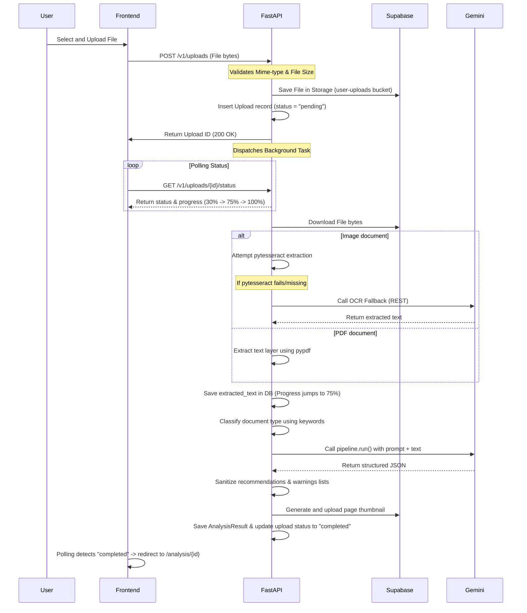

# Clarify AI — Granular Developer Guide & Architectural Reference

This document provides a highly detailed guide to the architecture, database schema, authentication flow, and implementation details of the Clarify AI platform. It is designed to explain everything from core design patterns to the smallest utility functions.

---

## 1. Directory Structure Reference

```
project/
├── backend/                       # FastAPI Python Backend
│   ├── app/
│   │   ├── api/                   # API Endpoints (v1)
│   │   │   ├── analysis.py        # Analysis retrieval, sharing, and PDF export
│   │   │   ├── chat.py            # Streamed document Q&A and chat suggestions
│   │   │   ├── health.py          # Liveness and database connectivity checks
│   │   │   ├── router.py          # Master API router uniting all endpoints
│   │   │   └── uploads.py         # File uploads, validation, and status polling
│   │   ├── middleware/
│   │   │   ├── auth.py            # Supabase JWKS JWT validation middleware
│   │   │   └── rate_limit.py      # Tier-based API rate limit guards
│   │   ├── models/                # SQLAlchemy Database Models
│   │   │   ├── analysis.py        # AnalysisResult model (structured AI outputs)
│   │   │   ├── upload.py          # Upload and SharedAnalysis models
│   │   │   └── user.py            # User schema and local subscription state
│   │   ├── pipelines/             # AI Analysis Pipelines per document type
│   │   │   ├── base_pipeline.py   # Base class containing defensive parsing rules
│   │   │   ├── bill_pipeline.py   # Utility bills and statements pipeline
│   │   │   ├── government_pipeline.py # Government notices and regulations pipeline
│   │   │   ├── legal_pipeline.py  # Legal contract review pipeline
│   │   │   ├── medical_pipeline.py # Medical prescription note pipeline
│   │   │   ├── receipt_pipeline.py # Finance invoices and purchase receipt pipeline
│   │   │   ├── scam_pipeline.py    # Phishing/SMS fraud analysis pipeline
│   │   │   └── screenshot_pipeline.py # UI screenshot error troubleshooting pipeline
│   │   ├── prompts/
│   │   │   └── system_prompts.py  # Gemini JSON system prompts & schemas
│   │   ├── schemas/               # Pydantic validation schemas
│   │   │   ├── analysis.py        # PipelineResult and AnalysisResponse schemas
│   │   │   └── upload.py          # UploadStatus and UploadList response schemas
│   │   ├── services/
│   │   │   ├── analysis_service.py # Core background task orchestrator
│   │   │   ├── classification_service.py # Keyword and regex document classifier
│   │   │   ├── llm_service.py     # Gemini client configuration & chat wrapper
│   │   │   ├── ocr_service.py     # Tesseract + Gemini Vision fallback OCR
│   │   │   └── pdf_service.py     # Custom clean PDF report generation engine
│   │   ├── utils/
│   │   │   ├── cache.py           # In-memory LRU cache to save Gemini tokens
│   │   │   ├── exceptions.py      # Custom HTTPException mapping logic
│   │   │   ├── file_utils.py      # Mime-type guards and image scaling helpers
│   │   │   └── text_utils.py      # Entity extraction (Regex-based dates/amounts)
│   │   ├── config.py              # Application settings and env parsing
│   │   ├── database.py            # SQLAlchemy async engine & session maker
│   │   └── main.py                # FastAPI app initialization and CORS middleware
│   ├── requirements.txt           # Python dependency file
│   └── Dockerfile                 # Multi-stage production build container
│
├── frontend/                      # Next.js 14 Web Application
│   ├── app/
│   │   ├── (auth)/                # Exclusive Google OAuth login screens
│   │   ├── (dashboard)/           # Main application screens (Client-only auth)
│   │   │   ├── analysis/          # Analysis details and interactive dashboard
│   │   │   ├── history/           # History of uploads with search/filters
│   │   │   ├── stats/             # Subscription usage charts and statistics
│   │   │   ├── upload/            # Upload widget and progress screens
│   │   │   └── layout.tsx         # Sidebar wrapper with Brave hydration bypass
│   │   ├── globals.css            # Base Tailwind and CSS tokens
│   │   └── layout.tsx             # Root layout with ThemeProvider and toaster
│   ├── components/                # Reusable UI widgets
│   │   ├── analysis/              # Risk gauge, chat box, timeline, and summaries
│   │   └── upload/                # Drag-and-drop dropzones & progress bars
│   ├── hooks/                     # Custom React hooks (polling status)
│   └── lib/                       # API clients and Supabase client helpers
│
├── supabase/                      # Supabase database configuration
│   └── migrations/                # Database migrations (001_extensions.sql to 007_disaster.sql)
│
├── deploy.sh                      # Shell script for live server launch
└── start-dev.sh                   # Dev script enforcing Python 3.14 ABI compat
```

---

## 2. Granular Architectural Core

### 2.1 The Database & Session Pooler (IPv6 Bypass)
*   **The Issue:** Direct connections to `db.[id].supabase.co:5432` resolve exclusively to **IPv6** addresses. If your local development router or ISP does not support IPv6 routes, connection attempts time out.
*   **The Fix:** We connect via the **Supabase connection pooler** (`[pooler-host].pooler.supabase.com:5432`). It resolves to an **IPv4** address, bypassing the IPv6 routing constraint.
*   **Pooling Mode:** Port `5432` uses **Session Mode**, which behaves like a standard direct connection and supports persistent database sessions. 
*   **SQLAlchemy Async Engine:** Connects via `postgresql+asyncpg` for non-blocking I/O.
    ```python
    engine = create_async_engine(settings.DATABASE_URL, pool_size=10, max_overflow=20)
    ```

### 2.2 JWT Authentication Middleware (JWKS)
FastAPI secures its routes using a custom dependency `CurrentUser`.
1.  **Extract Token:** Checks the `Authorization: Bearer <token>` header. If missing, it checks for a `?token=...` query parameter (enabling direct browser downloads/exports).
2.  **Verify Asymmetric Keys (RS256 / ES256):** Supabase signs JWTs with asymmetric keys. The middleware:
    *   Reads the token header to get the Key ID (`kid`).
    *   Fetches the JSON Web Key Set (JWKS) from your Supabase endpoint: `https://[ref].supabase.co/auth/v1/jwks.json`.
    *   Caches the JWKS keys in memory (`_jwks_cache`) to avoid fetching them on every request.
    *   Decodes and validates the signature using the matching public key.
3.  **Local User Sync:** Maps the validated `sub` (Supabase User ID) to the local database `users` table. If the user doesn't exist locally, it auto-creates the user profile.

### 2.3 LLM Service (Gemini 2.5 Flash over REST)
*   **Model:** Configured to use the modern, active `gemini-2.5-flash` model. Older model references (like `gemini-1.5-flash`) have been deprecated and return a 404 error.
*   **Transport Mode (`transport="rest"`):** The Gemini SDK defaults to using **gRPC**. In many local environments, gRPC connections to Google services are throttled or blocked by local firewalls/ISPs, causing queries to hang indefinitely. Setting `transport="rest"` forces standard HTTP/1.1 or HTTP/2, which is open and runs in under 3 seconds.
*   **JSON Enforcement:** In `LLMService`, the default `GenerativeModel` is instantiated with `response_mime_type="application/json"` to ensure structured JSON output. However, in `OCRService`, a clean model is instantiated *without* this constraint, preventing errors when extracting raw text.

---

## 3. Step-by-Step Execution Flows

### 3.1 Document Upload & Parsing Flow


### 3.2 PDF Export Flow
1.  **Click Download:** The user clicks "Export PDF" in the dashboard header.
2.  **Auth Token Retrieval:** The frontend fetches the session token locally via `getAccessToken()`.
3.  **Construct Link:** Builds the URL: `http://localhost:8000/v1/analysis/{id}/export?token={jwt}`.
4.  **Open Tab:** Triggers download. The browser issues a `GET` request.
5.  **FastAPI Auth:** The middleware extracts the `token` parameter, validates it, and authorizes the user.
6.  **PDF Compilation:** `pdf_service.py` compiles the database record into a clean, paginated PDF format and streams the bytes back as an attachment.

---

## 4. Key Performance Optimizations

### 4.1 Title Generation Bypass
Previously, the backend made a separate, sequential Gemini call just to generate a title for the document. Since Gemini is already analyzing the entire document, we updated the system prompts to return an `"auto_title"` key inside the main analysis JSON. The backend now uses this title directly, completely saving one API call (~1.5s saved per document).

### 4.2 Robust Defensive Sanitization
If Gemini returns warning/recommendation lists containing plain strings (like `["Warning message"]`) instead of objects, the `BasePipeline._enrich_result` sanitization function automatically intercepts and wraps them in a valid Pydantic format before validation occurs:
```python
if isinstance(item, str):
    clean_recs.append({
        "priority": "medium",
        "action": item,
        "reason": "Suggested action based on document analysis."
    })
```
This protects the backend from throwing a `ValidationError` and halting the processing pipeline.
